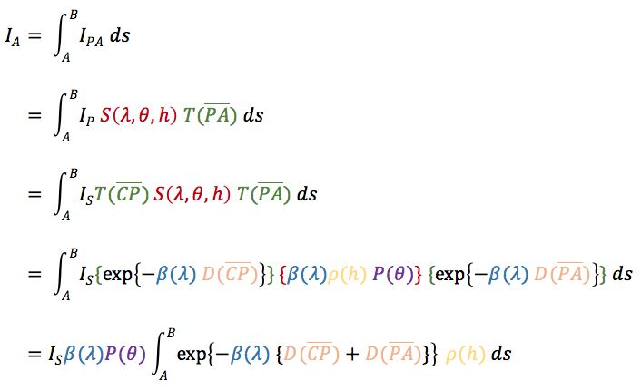

# 基于物理的天空盒

[TOC]


### 理论基础

> 主要参考：
>
> - Real-Time Rendering 4
> - Games-104
> - [Volumetric Atmospheric Scattering](https://www.alanzucconi.com/2017/10/10/atmospheric-scattering-1/)
> - [[Rendering] 基于物理的大气渲染](https://zhuanlan.zhihu.com/p/36498679)

大气散射原理的要点，就是积分，将路径上各点所接受的光经过散射衰减后，剩余到达相机的积分总和。如果是单极散射，那么路径上所接受的光就只考虑太阳光。如果是多级散射，那么所接受的光还包括四周其他地方散射出来的光。后面，我们先只考虑单极散射。

<div align=center>

</div>

<center>▲ 单级散射的公式</center>

> - Is 代表入射的太阳光， Ip 代表该点接受的太阳光。
> - S 代表散射系数（Scattering），与光的波长，light 与 view 的夹角，高度有关。可分为 瑞利散射系数 和 米散射系数。是可以预计算，查表的。
> - T 代表衰减系数（Transmittance），与距离有较大关系，是积分项，受角度，高度的影响
> - β 是当高度为 0 时，对散射做球面积分获得的总散射系数，与波长相关。
> - ρ 是大气的相对密度，与高度相关。
> - P 是相位函数，决定光线向各个方向的散射量。
> - D 是光学深度，就是路径上大气相对密度的积分。

可以看到，有几种优化思路。

第一种，牺牲质量的粗暴思路，就是假设大气处处密度相同，即 ρ = 1。这使得 D（光学深度）等于距离，无需积分，从而减去大部分运算量。

第二种，预计算 LUT。因为 D 的参数为与 up 轴夹角 和 高度，可以分别表示 u，v坐标。预计算这部分积分，也可以减少大部分运算量。

还有没有更少的计算量的方法，似乎没有了，走一遍积分还是无法避免的。不过，可以在天空盒的顶点着色器完成计算，运算量大减。但是，在清晨傍晚等天色在地平线处变化较大时会有瑕疵。

最后，由于是单极散射，最终效果是损失一部分能量的，可以手动提亮。

### 单极散射的大气渲染，无预计算

下面实操。先写无 LUT 优化的。

以上式子中，β 和 P 在 rayleigh 散射和 mie 散射中是不同的，故需要分别做积分。但是光学深度 D 两者相同，可以不做多余积分，一同利用。

接下来，就是实现上面各个函数。先是做好数据定义与整合：

```c
// 一些常数
static const float sRefractive = 1.00029;
static const float sAtmosphereDensity = 2.504e25;

static const float3 sWaveLengths = float3(680.0, 550.0, 440.0) * 1e-9;  // nm to m
static const float3 sRayleighScatteringCoefficients =
    float3(0.00000519673, 0.0000121427, 0.0000296453);
static const float sMieScatteringCoefficient = 0.0001;
static const float3 sMieScatteringCoefficients =
    float3(0.0001, 0.0001, 0.0001);
```

```c
struct ScatteringData // 输入的基本信息
{
    float3 lightColor;
    float3 rayleighSC;
    float3 mieSC;
    float radius;
    float thickness;
    float scale;
    float exposure;
    float gMie;
    float rayleighFac;
    float mieFac;
    float sampleCounts;
};

struct PathData // 运算过程中产生的路径信息
{
    float3 startPos;
    float3 endPos;
    float3 pathDir;
    float pathLength;
};
```

大气渲染离不开球体求交，这里使用解方程的方法：

```c
/**
 * \brief 
 * \param tIn In sphere intersection point t
 * \param tOut Out sphere intersection point t
 * \param D Ray direction
 * \param O Ray original
 * \param C Sphere center
 * \param R Sphere radius
 */
void GetSphereIntersection(out float tIn, out float tOut, float3 D, float3 O, float3 C, float R)
{
    float3 co = O - C;
    float a = dot(D, D);
    float b = 2.0 * dot(D, co);
    float c = dot(co, co) - R * R;
    float m = sqrt(max(b * b - 4.0 * a * c, 0.0));
    float div = rcp(2.0 * a);

    tIn = (-b - m) * div;
    tOut = (-b + m) * div;
}
```

开始实现函数：

```c
// βm()
float3 GetMieScatteringCoefficients()
{
    return sMieScatteringCoefficients;
    // 以下是计算式，由于是常量，其实可以直接返回计算好的式子，以下函数同理
    float var1 = sRefractive * sRefractive - 1.0;
    return 8.0 * PI * PI * PI * var1 * var1 * rcp(3.0 * sAtmosphereDensity);
}

// βr(λ)
float3 GetRayleighScatteringCoefficients(float3 waveLengths)
{
    return sRayleighScatteringCoefficients;
    // 
    float var1 = sRefractive * sRefractive - 1.0;
    float3 var2 = waveLengths * waveLengths;
    var2 = var2 * var2;
    return 8.0 * PI * PI * PI * var1 * var1 * rcp(3.0 * sAtmosphereDensity * var2);
}

// ρ(h)
float GetDensityRatio(float height, float thickness)
{
    return exp(-height * rcp(thickness));
}

// Pr(θ)
float GetRayleighPhaseFunction(float cosTheta)
{
    return 3.0 * (1.0 + cosTheta * cosTheta) * rcp(16.0 * PI);
}

// Pm(θ)
float GetMiePhaseFunction(float cosTheta, float g)
{
    float g2 = g * g;
    float cos2 = cosTheta * cosTheta;
    float num = 3.0 * (1.0 - g2) * (1.0 + cos2);
    float denom = rcp(8.0 * PI * (2.0 + g2) * pow(abs(1.0 + g2 - 2.0 * g * cosTheta), 1.5));
    return num * denom;
}

// D(A->B)
float GetOpticalDepth(ScatteringData scaData, PathData pathData)
{
    float opticalDepth = 0.0;
    float distanceStep = pathData.pathLength * rcp(scaData.sampleCounts);

    float3 currPos = pathData.startPos + pathData.pathDir * distanceStep * 0.5;

    UNITY_LOOP
    for (int i = 0; i < scaData.sampleCounts; ++i)
    {
        float height = length(currPos - float3(0.0, -scaData.radius, 0.0)) - scaData.radius;
        
        // 路径上相对密度的积分
        opticalDepth += GetDensityRatio(height, scaData.thickness) * distanceStep * scaData.scale;

        currPos += distanceStep * pathData.pathDir;
    }

    return opticalDepth;
}

// Tr(A->B)
float3 GetRayleighTotalTransmittances(ScatteringData scaData, PathData lightData, PathData viewData)
{
    float depthAB = GetOpticalDepth(scaData, lightData);
    float depthBC = GetOpticalDepth(scaData, viewData);
    return exp(-scaData.rayleighSC * (depthAB + depthBC));
}

// Tm(A->B)
float3 GetMieTotalTransmittances(ScatteringData scaData, PathData lightData, PathData viewData)
{
    float depthAB = GetOpticalDepth(scaData, lightData);
    float depthBC = GetOpticalDepth(scaData, viewData);
    return exp(-scaData.mieSC * (depthAB + depthBC));
}
```

至此，完成了以上函数后，就可以求最终解了：

```c
float3 GetInscatteringColor(ScatteringData scaData, float3 lightDir, float3 viewDir, float3 viewPosWS)
{
    float3 viewPos = TransformWorldToSpecial(viewPosWS);

    PathData viewPathData = GetViwePathData(scaData, viewPos, viewDir);

    // view 路径不存在，直接返回
    UNITY_BRANCH
    if (viewPathData.pathLength < FLT_EPS)
    {
        return 0.0;
    }

    float3 inscatterRay = 0.0;
    float3 inscatterMie = 0.0;
    float stepLength = viewPathData.pathLength * rcp(scaData.sampleCounts);
    
    float3 currPos = viewPathData.startPos + viewPathData.pathDir * stepLength * 0.5;
    viewPathData.pathLength -= stepLength * 0.5;

    UNITY_LOOP
    for (int i = 0; i < scaData.sampleCounts; ++i)
    {
        float height = length(currPos - float3(0.0, -scaData.radius, 0.0)) - scaData.radius;

        PathData lightPathData = GetLightPathData(scaData, currPos, lightDir);

        // 光路径被遮挡，直接计算下一轮迭代
        UNITY_BRANCH
        if (lightPathData.pathLength < FLT_EPS)
        {
            currPos += stepLength * viewPathData.pathDir;
            continue;
        }

        // 对 Rayleigh 和 Mie 分别积分求和
        float ratio = GetDensityRatio(height, scaData.thickness);
        float2 depths = GetOpticalDepths(scaData, lightPathData, viewPathData);
        float3 transRay = GetRayleighTotalTransmittances(scaData, depths);
        float3 transMie = GetMieTotalTransmittances(scaData, depths);
        inscatterRay += transRay * ratio * stepLength * scaData.scale;
        inscatterMie += transMie * ratio * stepLength * scaData.scale;
        
        currPos += stepLength * viewPathData.pathDir;
        viewPathData.pathLength -= stepLength;
    }

    // 输出结果，参照公式即可
    float cosTheta = dot(-lightDir, viewDir);
    float3 resultRay = scaData.rayleighFac * scaData.rayleighSC * GetRayleighPhaseFunction(cosTheta) * inscatterRay;
    float3 reslutMie = scaData.mieFac * scaData.mieSC * GetMiePhaseFunction(cosTheta, scaData.gMie) * inscatterMie;
    return scaData.lightColor * (resultRay + reslutMie) * scaData.exposure;
}
```

最后添加太阳，思路是使用 Mie 相位函数，使用接近与 1 的 g 值，可以模拟太阳。

注意，太阳渲染必须在片段着色器中计算：

```c
float3 GetSunRenderColor(float3 sunColor, float3 lightDir, float3 viewDir, float gSun)
{
    float visual = smoothstep(-0.01, 0.0, dot(viewDir, float3(0.0, -1.0, 0.0)));
    return sunColor * GetMiePhaseFunction(dot(-lightDir, viewDir), gSun) * visual;
}
```


**效果：**


### 基于屏幕空间后处理的大气透视雾效，体积光

天空盒完成了，但是天空和山还是有些格格不入。这是因为缺少了大气透射和体积光。

大气透射怎么计算？其实原理一致，渲染路径中的 inscattering，只不过需要加上物体本身经过路径衰减后的颜色，公式如下：
$$
Color_{eye}=Color_{obj} * Excintion_{AB} + Inscatering_{AB}
$$
其中：
$$
Excintion_{AB}=T(AB)=e^{-\beta \cdot AB}
$$
而 inscattering 可以像前面一样积分求解，也可以假设各处的相对密度都一样，且只考虑 AB 段的光学深度，可得以下公式：
$$
Inscattering_{AB}=I_{in}\cdot P(\theta)\cdot (1-e^{\beta \cdot AB})
$$


然而，简化的效果无法做到体积光，体积光仍然需要路径积分。为了确定遮挡关系，需要采样 shadowmap 确定路径点是否在阴影中，是否需要计算 inscattering。

首先，关于 Shader 的渲染时机，我选择使用屏幕空间后处理渲染雾效。因为这样可以不去修改和破坏已有的 Shader，也可以减少 OverDraw。

可以使用我之前写过的 PostProcessRendererFeature， 添加 ScreenSpaceFogPass。

Volume 可见 ScreenSpaceFog.cs。

```c#
public class ScreenSpaceFogPass : ScriptableRenderPass
{
    private const string ScreenSpaceFogShaderName = "Hidden/Custom/Post-processing/Screen Space Fog";

    private static readonly int LightColorId = Shader.PropertyToID("_LightColor");
    private static readonly int ExposureId = Shader.PropertyToID("_Exposure");
    private static readonly int ThicknessId = Shader.PropertyToID("_Thickness");
    private static readonly int RadiusId = Shader.PropertyToID("_Radius");
    private static readonly int RScaleId = Shader.PropertyToID("_RScale");
    private static readonly int RayleighFacId = Shader.PropertyToID("_rayleighFac");
    private static readonly int MieFacId = Shader.PropertyToID("_mieFac");
    private static readonly int GMieId = Shader.PropertyToID("_gMie");
    private static readonly int SampleCountsId = Shader.PropertyToID("_SampleCounts");

    private string _profilerTag;
    private ProfilingSampler _profilingSampler;

    private RenderTargetHandle _backRT;
    private Material _material;

    private bool _swap;

    public ScreenSpaceFogPass(string profilerTag)
    {
        Shader shader = Shader.Find(ScreenSpaceFogShaderName);

        if (shader == null)
        {
            Debug.LogError($"Can't find shader {ScreenSpaceFogShaderName}");
        }

        this.profilingSampler = new ProfilingSampler(nameof(CustomToneMappingPass));

        _profilerTag = profilerTag;
        _profilingSampler = new ProfilingSampler(profilerTag);
        _material = CoreUtils.CreateEngineMaterial(shader);

        if (_material == null)
        {
            Debug.LogError("Can't create blit material");
        }
    }

    public override void Execute(ScriptableRenderContext context, ref RenderingData renderingData)
    {
        var volume = VolumeManager.instance.stack.GetComponent<ScreenSpaceFog>();
        if (volume == null || !volume.IsActive() || _material == null)
        {
            return;
        }

        CommandBuffer cmd = CommandBufferPool.Get();
        using (new ProfilingScope(cmd, _profilingSampler))
        {
            // Ensure we flush our command-buffer before we render...
            context.ExecuteCommandBuffer(cmd);
            cmd.Clear();

            RenderTargetHandle source = new RenderTargetHandle();
            RenderTargetHandle dest = new RenderTargetHandle();
            if (_swap)
            {
                source = _backRT;
                dest.Init(renderingData.cameraData.renderer.cameraColorTarget);
            }
            else
            {
                source.Init(renderingData.cameraData.renderer.cameraColorTarget);
                dest = _backRT;
            }

            // Update data
            _material.SetColor(LightColorId, volume.lightColor.value);
            _material.SetFloat(ExposureId, volume.exposure.value);
            _material.SetFloat(ThicknessId, volume.thickness.value);
            _material.SetFloat(RadiusId, volume.radius.value);
            _material.SetFloat(RScaleId, volume.radiusThicknessScale.value);
            _material.SetFloat(RayleighFacId, volume.rayleighFac.value);
            _material.SetFloat(MieFacId, volume.mieFac.value);
            _material.SetFloat(GMieId, volume.mieCoefficientG.value);
            _material.SetFloat(SampleCountsId, volume.sampleCounts.value);

            // Blit
            cmd.SetGlobalTexture("_MainTex", source.Identifier());
            Blit(cmd, source.Identifier(), dest.Identifier(), _material, 0);
        }
        context.ExecuteCommandBuffer(cmd);
        CommandBufferPool.Release(cmd);
    }

    public void Setup(RenderTargetHandle back, RenderPassEvent passEvent, bool swap)
    {
        this.renderPassEvent = passEvent;

        _backRT = back;
        _swap = swap;
    }
}
```

至于Shader的代码，基本上只需在函数中插入对 shadowmap 采样的代码，判断是否参与计算。代码如下：

```c
// 转换到 shadowmap 空间的坐标
float4 shadowCoord = TransformWorldToShadowCoord(currRealPos);
// 是否在阴影中
float shadow = MainLightRealtimeShadow(shadowCoord);

// 如果在阴影中，不参与计算 inscattering
UNITY_BRANCH
if (shadow < 0.1)
{
    currRealPos += stepRealLength * viewPathData.pathDir;
    currPos += stepLength * viewPathData.pathDir;
    continue; // 下一个循环
}
```


**效果：**


看完效果后接下来该考虑如何优化，减少采样次数了。


### 使用预计算的 LUT 优化

可以使用 Compute Shader 对光学深度 D，相对密度 ρ 进行预计算。

先写好控制脚本：（SKyboxLUTRenderer.cs）

```c#
[ExecuteAlways]
public class SkyboxLUTRenderer : MonoBehaviour
{
    public ComputeShader computeShader;
    public Material material;

    [Serializable]
    public class LutSetting
    {
        [Serializable]
        public enum Size : int
        {
            _16x16 = 16,
            _32x32 = 32,
            _64x64 = 64,
            _128x128 = 128,
            _256x256 = 256,
            _512x512 = 512,
            _1024x1024 = 1024
        }

        public Size size = Size._512x512;
    }

    public LutSetting LUTSetting;

    public RenderTexture _skyboxLUT;
    private bool _baked = false;

    private static readonly string KernelName = "PBRSkyboxLUTPre";
    private static readonly string TextureName = "_SkyboxLUT";

    private static readonly int LookupTableId = Shader.PropertyToID(TextureName);
    private static readonly int LightColorId = Shader.PropertyToID("_LightColor");
    private static readonly int ThicknessId = Shader.PropertyToID("_Thickness");
    private static readonly int RadiusId = Shader.PropertyToID("_Radius");
    private static readonly int RScaleId = Shader.PropertyToID("_RScale");
    private static readonly int SampleCountsId = Shader.PropertyToID("_SampleCounts");
    private static readonly int ExposureId = Shader.PropertyToID("_Exposure");
    private static readonly int GMieId = Shader.PropertyToID("_gMie");
    private static readonly int MieFacId = Shader.PropertyToID("_mieFac");
    private static readonly int GSunId = Shader.PropertyToID("_gSun");

    public void Bake()
    {
        Debug.Log("Skybox LUT Renderer: Bake LUT");

        _baked = false;
    }

    private void Start()
    {
        CreateRenderTexture();
        SetMaterial();
    }

    private void Update()
    {
        if (computeShader == null || material == null || _baked)
        {
            return;
        }

        UpdateRenderTexture();
        Render();

        material.SetTexture(LookupTableId, _skyboxLUT);

        _baked = true;
    }

    private void OnDestroy()
    {
        DestroyRenderTexture();
    }

    private void OnValidate()
    {
        _baked = false;
    }

    void CreateRenderTexture()
    {
        if (_skyboxLUT != null)
        {
            _skyboxLUT.Release();
        }

        _skyboxLUT = new RenderTexture((int)LUTSetting.size, (int)LUTSetting.size, 0, 
            RenderTextureFormat.RGFloat, RenderTextureReadWrite.Linear);
        _skyboxLUT.wrapMode = TextureWrapMode.Clamp;
        _skyboxLUT.filterMode = FilterMode.Bilinear;
        _skyboxLUT.enableRandomWrite = true;
        _skyboxLUT.useMipMap = false;
        _skyboxLUT.Create();
    }

    void UpdateRenderTexture()
    {
        if (_skyboxLUT == null || _skyboxLUT.width != (int)LUTSetting.size)
        {
            CreateRenderTexture();
            _baked = false;
        }
    }

    void DestroyRenderTexture()
    {
        if (_skyboxLUT)
        {
            _skyboxLUT.Release();
        }
    }

    void SetMaterial()
    {

    }

    void Render()
    {
        float thickness = material.GetFloat(ThicknessId);
        float radius = material.GetFloat(RadiusId);
        float rScale = material.GetFloat(RScaleId);
        float sampleCounts = material.GetFloat(SampleCountsId);
        float exposure = material.GetFloat(ExposureId);
        float gMie = material.GetFloat(GMieId);
        float mieFac = material.GetFloat(MieFacId);
        float gSun = material.GetFloat(GSunId);

        int kernel = computeShader.FindKernel(KernelName);
        computeShader.SetTexture(kernel, TextureName, _skyboxLUT);
        computeShader.SetVector(LightColorId, Vector4.one);
        computeShader.SetFloat(ThicknessId, thickness);
        computeShader.SetFloat(RadiusId, radius);
        computeShader.SetFloat(RScaleId, rScale);
        computeShader.SetFloat(SampleCountsId, sampleCounts);
        computeShader.SetFloat(ExposureId, exposure);
        computeShader.SetFloat(GMieId, gMie);
        computeShader.SetFloat(MieFacId, mieFac);
        computeShader.SetFloat(GSunId, gSun);

        uint x, y, z;
        computeShader.GetKernelThreadGroupSizes(kernel, out x, out y, out z);
        computeShader.Dispatch(kernel, (int)LUTSetting.size / (int)x, (int)LUTSetting.size / (int)y, 1);
    }
}
```

然后是写 LUT compute shader：

```c
#include "Assets/Shaders/ShaderLibrary/AtmosphereScattering.hlsl"

// Each #kernel tells which function to compile; you can have many kernels
#pragma kernel PBRSkyboxLUTPre

// Create a RenderTexture with enableRandomWrite flag and set it
// with cs.SetTexture
RWTexture2D<float4> _SkyboxLUT;

float4 _LightColor;

float _Thickness;
float _Radius;
float _RScale;
float _SampleCounts;
float _Exposure;

float _rayleighFac;
float _mieFac;
float _gMie;
float _gSun;

#define RADIUS (_Radius * 1000.0)       // km to m
#define THICKNESS (_Thickness * 1000.0) // km to m

[numthreads(16, 16, 1)]
void PBRSkyboxLUTPre(uint3 id : SV_DispatchThreadID)
{
    float w, h;
    _SkyboxLUT.GetDimensions(w, h);

    // uv 分别对应的实际的值
    float height = (id.x + 0.5) * _Thickness * rcp(w);
    float cosTheta = (id.y + 0.5) * 2.0 * rcp(h) - 1.0;

    ScatteringData sData = GetScatteringData(_LightColor.xyz, RADIUS, THICKNESS, _RScale, _Exposure, _gMie,
        _rayleighFac, _mieFac, 300.0);

    // 构造 路径数据 用于计算
    float3 objPos = float3(0.0, height, 0.0);
    float3 lightDir = float3(0.0, cosTheta, sqrt(1.0 - cosTheta * cosTheta));
    PathData pData = GetLightPathData(sData, objPos, lightDir);
    
    float opticalDepth = GetOpticalDepth(sData, pData);
    float densityRatio = GetDensityRatio(height, sData.thickness);

    _SkyboxLUT[id.xy] = float4(opticalDepth, densityRatio, 0.0, 0.0);
}
```

