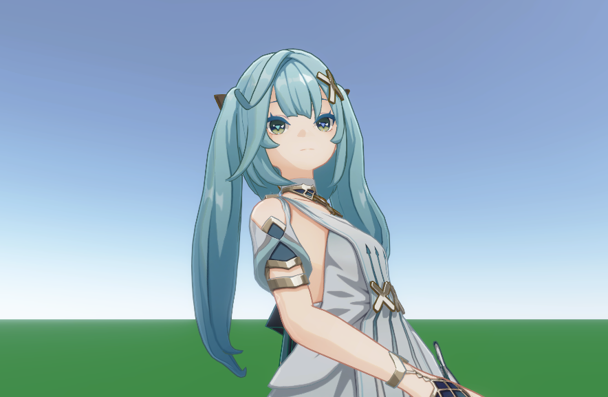
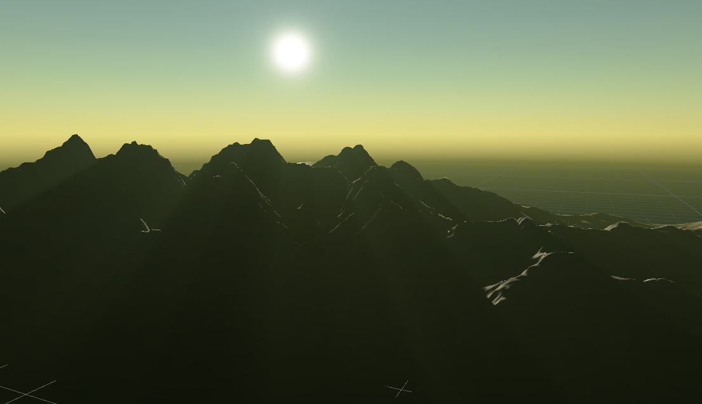

# Unity_URP_NPR_Sample

*URP are indeed used, but NPR not just included.*

> 记录项目所包含的内容，留下文档

#### 渲染篇

##### **仿原神的NPR角色渲染：** [ReadMe](./Documents/AvatarNPR.md)

##### **PBR程序天空盒 （单极散射）：**[ReadMe](./Documents/SkyboxPBR.md)

##### 工具篇

自定义ShaderGUI，可以表示单层嵌套折叠项：

类Blender相机的相机控制脚本：[Script](./Assets/Scripts/Controller/CameraController/CameraDurroundPoint.cs)
